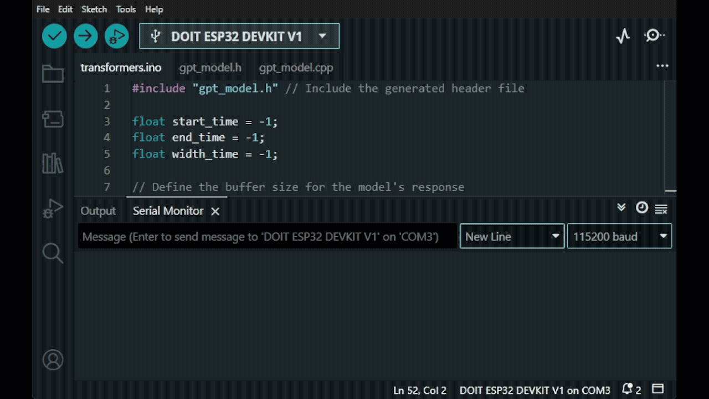
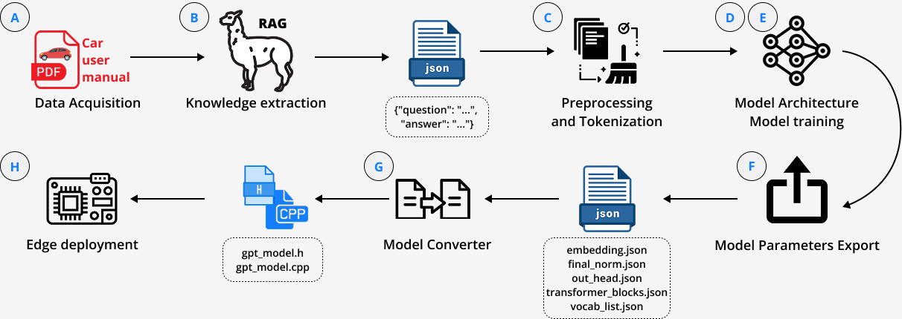
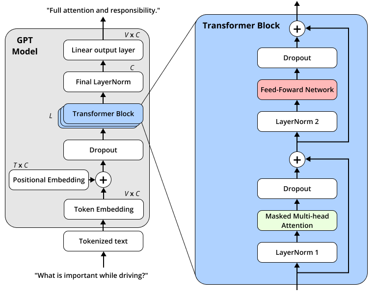
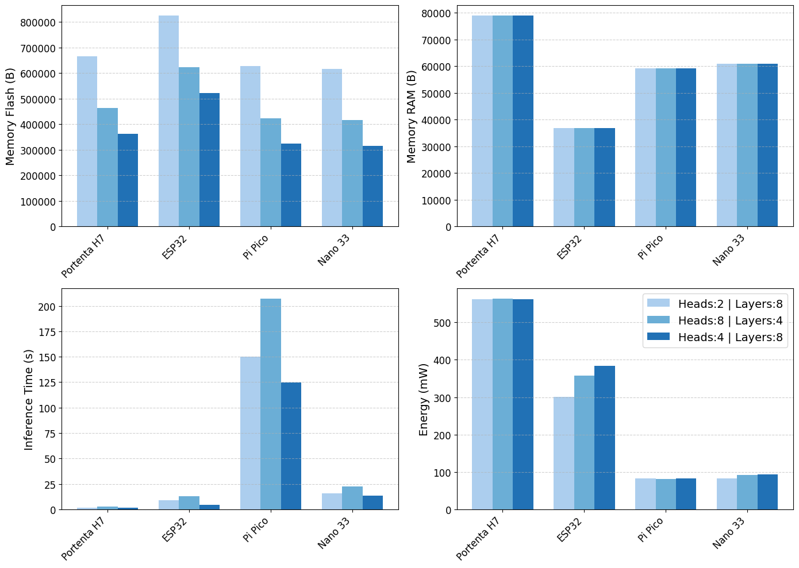

&nbsp;
&nbsp;
<p align="center">
  
</p> 

&nbsp;

# TinyGPT at the Edge: A Small Language Model for Vehicle Manual Assistance

### ✍🏾Authors: [Thommas Flores](https://github.com/thommaskevin), [Daniel Costa](https://github.com/daniel-gcosta) and [Ivanovitch Silva](https://github.com/ivanovitchm)


This repository contains the code and resources for the paper "TinyGPT at the Edge: A Small Language Model for Vehicle Manual Assistance". This study integration of Small Language Models (SLMs) into embedded systems enables intelligent, real-time interactions in resource-constrained environments such as automotive interfaces, where cloud dependency is impractical. This paper presents a methodology for deploying lightweight GPT-based SLMs on microcontroller boards (Arduino Portenta H7, ESP32, Raspberry Pi Pico, and Nano 33 BLE) to answer user queries about vehicle manuals offline. We propose a direct Python-to-C++ conversion pipeline, avoiding quantization or external libraries, and evaluate model variants with {2-8} layers and {2-16} attention heads. Particularly, the 8-head, 4-layer configuration achieved the best test performance (loss: 10.86), demonstrating an effective balance between accuracy and efficiency. On the Portenta H7, it delivered low latency and energy usage (1.49 s, 561.37 mW), while lighter models (e.g., 2-head, 2-layer) reduced energy consumption at the cost of significantly higher loss (13.11). Experiments revealed hardware-specific trade-offs: the ESP32 provided a balanced profile, while the Pi Pico, despite operating under 100 mW, suffered from high latency (>200 s). The proposed solution supports fully offline, library-free inference on automotive-grade MCUs, enabling practical edge NLP deployments.

<p align="center">
  
</p>


📁 Repository structure:

```plaintext
TINYGPT-SLM
src/
├── codes/
│   ├── arduino/
│   │   ├── gpt_model.cpp
│   │   ├── gpt_model.h
│   │   └── tinyGPT_SLM.ino
├── src/
│   ├── model/
│   ├── utils/
│   │   └── __init__.py
│   └── slm.py
│   ├── 01_dataset_generator.ipynb
│   ├── 02_training_model.ipynb
│   └── 03_results_analysis.ipynb
├── data/
│   ├── t-cross-2025-owners-manual-rhd-uk-australia.pdf
│   ├── test_dataset.json
│   └── training_dataset.json
├── figures/
├── model_results/
├── .gitignore
├── LICENSE
├── README.md
└── requirements.txt
```
---
## 📤 Installation

- Install **Python v3.9.6**


- Clone this repository.
 

- Inside the cloned repository folder, open the terminal or command prompt and run:
```bash
python -m venv .venv
```

- Activate the virtual environment:
```bash
.venv\Scripts\activate
```

- Install the required packages inside the environment:
```bash
pip install -r requirements.txt
```

- Install Ollama:

https://ollama.com/download/windows

- Download the LLM model to RAG

```bash
ollama run llama3.2
```


## 📝 Proposed Approach

This work proposes an alternative approach based on the direct conversion of SLMs derived from GPT-2, initially trained in Python, into C++ implementations. This strategy aims to preserve the original model functionality while ensuring probabilistic and real-time inference, without relying on quantization techniques or external libraries. Our approach was validated on four widely used MCU platforms: Arduino Nano BLE Sense 33, Portenta H7, ESP32, and Raspberry Pi Pico. The models were configured to operate fully offline and provide responses to user queries about a vehicle's manual, as defined in the experimental setup. The defined workflow to achieve the objectives of this study is shown in Fig. 1.


The study addresses two key research questions (**RQ**):  

- **RQ1:**   How does the architectural variation of SLMs, in terms of the number of layers and attention heads, influence training accuracy and efficiency, considering metrics such as training time, loss, and parameter complexity?
         
- **RQ2:**  What are the effects of deploying SLMs on different MCUs in terms of inference time, energy consumption, and their suitability for real-time automotive applications?


<p align="center">
  
</p>


The architecture adopted in the proposed approach is based on a lightweight adaptation of the GPT encoder-only transformer model, tailored for edge environments. As illustrated in Fig. 2, the model follows a standard transformer-based pipeline composed of embedding layers, multiple transformer blocks, and a final projection layer. This design facilitates training compact models while retaining the core architectural advantages of the original GPT-2.


<p align="center">
  
</p>

## 📚 Jupyter Notebooks


-  [](https://github.com/conect2ai/TinyGPT-SLM/blob/main/codes/01_dataset_generator.ipynb) Dataset Generator


-  [](https://github.com/conect2ai/TinyGPT-SLM/blob/main/codes/02_training_model.ipynb) Training the model


-  [](https://github.com/conect2ai/TinyGPT-SLM/blob/main/codes/03_results_analysis.ipynb) Analisys Results


## 📚 Arduino Codes

-  [](https://github.com/conect2ai/TinyGPT-SLM/blob/main/codes/arduino/tinyGPT_SLM.ino) Arduino ML code


## 📊 Results


The experiments evaluated the performance of the proposed language model using configurations with combinations of heads ranging from 2 to 16 and layers from 2 to 8. A dropout rate of 10% was applied uniformly across layers to mitigate overfitting. Moreover, training was conducted over 1000 epochs using the Cross-Entropy Loss function, with the padding token excluded from the loss computation. The optimizer employed was AdamW, with an initial learning rate set to 0.001. Table 1 summarizes the main results.


| **Heads** | **Layers** | **Parameters** | **Loss (Train)** | **Loss (Test)** | **Time** | **Energy (kWh)** |
|------------|-------------|---------------|-----------------|---------------|----------|----------------|
| 16         | 8           | 130,112       | 0.3885          | 14.33         | 00:12:52 | 0.0120650     |
| 8          | 8           | 130,112       | 0.3632          | 11.93         | 00:09:12 | 0.0086228     |
| 4          | 8           | 130,112       | 0.3651          | 12.36         | 00:08:59 | 0.0084205     |
| 2          | 8           | 130,112       | 0.3658          | 11.873        | 00:07:32 | 0.0070670     |
| 16         | 4           | 79,680        | 0.3713          | 12.765        | 00:04:45 | 0.0044622     |
| 8          | 4           | 79,680        | 0.3649          | 10.8637       | 00:03:57 | 0.0036983     |
| 4          | 4           | 79,680        | 0.3648          | 11.1258       | 00:03:49 | 0.0035864     |
| 2          | 4           | 79,680        | 0.3654          | 13.09         | 00:03:44 | 0.0034941     |
| 16         | 2           | 54,464        | 0.3698          | 11.14         | 00:02:24 | 0.0022506     |
| 8          | 2           | 54,464        | 0.3698          | 11.526        | 00:02:22 | 0.0022160     |
| 4          | 2           | 54,464        | 0.3738          | 11.5984       | 00:02:15 | 0.0021115     |
| 2          | 2           | 54,464        | 0.3825          | 13.1101       | 00:01:55 | 0.0018034     |


Fig. 3 presents detailed results for three selected architectures. 


<p align="center">
  
</p> 


Configurations with a higher number of attention heads, while keeping the number of layers constant, generally achieved better test loss values. For instance, the architecture with 8-heads and 4-layers yielded the lowest test loss (10.86), indicating a strong balance between generalization and computational efficiency. In addition, the RAM memory usage remains constant across different numbers of layers and attention heads because intermediate structures, such as attention projections, attention outputs, and feedforward activations, are reused throughout the model. This memory allocation depends solely on embedding dimension and context length, optimizing resource usage for embedded systems.


## 🧠 Conclusion
This paper demonstrated an effective methodology for deploying SLMs on MCUs to enable offline question-answering about vehicular manuals. Our direct Python-to-C++ conversion approach achieved 1.49 s inference time with a 4-head, 8-layer configuration on the Portenta H7, while revealing critical hardware trade-offs between computational performance and energy efficiency.

The Portenta H7 delivered superior processing speed, whereas the Pi Pico maintained energy efficiency below 100 mW at the cost of higher latency exceeding 200 s. These findings validate our solution for probabilistic inference, offline automotive applications requiring reliable edge AI performance.

Future research will investigate quantization techniques for enhanced memory and performance optimization, expand the model's automotive knowledge domain, enable multilingual support, and explore hybrid MoE architectures.


## License

This package is licensed under the [MIT License](https://github.com/conect2ai/Conect2Py-Package/blob/main/LICENSE) - © 2023 Conect2ai.
